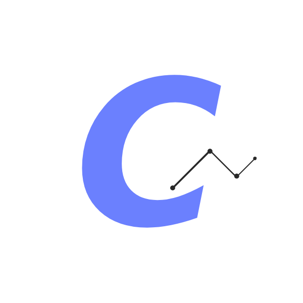
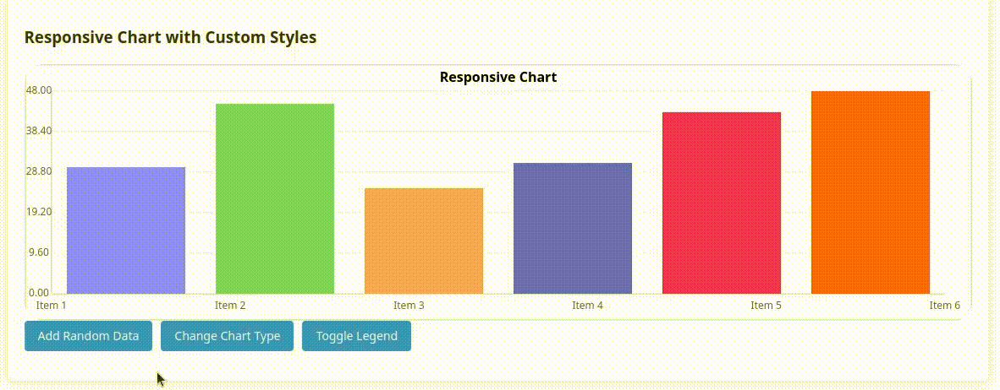

<!-- Improved compatibility of back to top link: See: https://github.com/othneildrew/Best-README-Template/pull/73 -->
<a id="readme-top"></a>


<!-- PROJECT LOGO -->
<br />
<div align="center">
  <a href="https://github.com/fckopsec/CurvJS">
    
  </a>

<h3 align="center">Curv.JS</h3>

  <p align="center">
    Modern & Responsive approach to Charts.
    <br />
    <a href="TBF"><strong>Documentation</strong></a>
    <br />
    <br />
    <a href="TBF">See Demo</a>
    &middot;
    <a href="https://github.com/fckopsec/CurvJS/issues/new?labels=bug&template=bug-report---.md">Report a Bug</a>
    &middot;
    <a href="https://github.com/fckopsec/CurvJS/issues/new?labels=enhancement&template=feature-request---.md">Request a Feature</a>
  </p>
</div>


  <a href="https://github.com/fckopsec/CurvJS">
    
  </a>


<!-- ABOUT THE PROJECT -->
## About The Project

#### CurvJS is a simple, one-file library that makes creating charts very easy and efficient.

### Built With
[](https://typescriptlang.org)

<!-- GETTING STARTED -->
## Getting Started

TBF

### Prerequisites

TBF
* npm
  ```sh
  TBF
  ```

### Installation

TBF


<!-- USAGE EXAMPLES -->
## Usage

TBF
<!--Use this space to show useful examples of how a project can be used. Additional screenshots, code examples and demos work well in this space. You may also link to more resources.

_For more examples, please refer to the [Documentation](https://example.com)_-->


<!-- ROADMAP 
## Roadmap

- [ ] Feature 1
- [ ] Feature 2
- [ ] Feature 3
    - [ ] Nested Feature

See the [open issues](https://github.com/github_username/repo_name/issues) for a full list of proposed features (and known issues).

<p align="right">(<a href="#readme-top">back to top</a>)</p>-->


## Contributing

If you have a suggestion that would make this better, please fork the repo and create a pull request. You can also simply open an issue with the tag "enhancement".
Don't forget to give the project a star! Thanks again!

1. Fork the Project
2. Create your Feature Branch (`git checkout -b feature/MyFeature`)
3. Commit your Changes (`git commit -m 'Add some MyFeature'`)
4. Push to the Branch (`git push origin feature/MyFeature`)
5. Open a Pull Request

### Top contributors:

<a href="https://github.com/fckopsec/CurvJS/graphs/contributors">
  
</a>


<!-- LICENSE -->
## License

Distributed under the MIT License. See `LICENSE.txt` for more information.


<!-- CONTACT -->
## Contact

Discord - @fuck0psec - Email - chiefkeef.pl@gmail.com

Project Link: [https://github.com/github_username/repo_name](https://github.com/github_username/repo_name)
